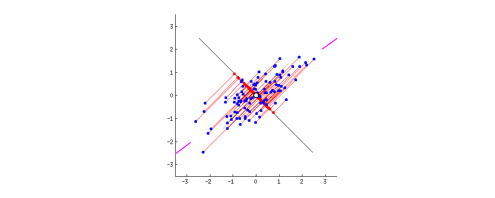

<h1 align="center">PointCloudMath</h1>

在处理点云时，常常用到一些基本的数学，在此处作为记录，总结一些在点云中比较重要的一些数学。

明月满街流水远，华灯入望众星高。

## **更新历史**

- 2023年8月24日

  初次撰写定有过多遗漏，多多包涵
- 2023年9月4日
  
  第二次撰写：对数学公式进行添加

## 目录

- [PCA](#pca)
  - [PCA](#pca-1)
    - [基础](#基础)
    - [基本思想](#基本思想)
  - [数学定义](#数学定义)
  - [Kernel PCA(核主成分分析)](#kernel-pca核主成分分析)
  - [Incremental PCA](#incremental-pca)
- [Sparse PCA(稀疏主成分分析)](#sparse-pca稀疏主成分分析)
  - [Robust PCA](#robust-pca)
  - [Probabilistic PCA](#probabilistic-pca)
  - [Non-negative Matrix Factorization(非负矩阵分解)](#non-negative-matrix-factorization非负矩阵分解)
  - [**许可协议**](#许可协议)
  
# PCA

## PCA

### 基础

&emsp;&emsp;**Principal component analysis** 主成分分析法，用于分析高维/特征的数据，在保留最大信息量的同时提高数据的可解释性，并实现多维数据的可观测性，整体来说，主成分分析是一种用于降低数据集维度的统计技术。

&emsp;&emsp;通过正交变换将数据线性变换到新的坐标系中，即投影为一系列线性不相关变量的值，这些不相关变量称为主成分。

&emsp;&emsp;在正交变换后的坐标系中，大部分数据可以用比初始数据更少的维度来描述。使其在低纬度暴露最多的特征，并可直观的观测到数据特征。

**简单来说，对数据进行降维，舍去影响小的维度，只保留特征明显的维度**。

---

### 基本思想

&emsp;&emsp;**C1第一主成分**: 将坐标轴中心移到数据的中心，然后旋转坐标轴，使得数据在C1轴上的方差最大，即全部n个数据个体在该方向上的投影最为分散。意味着更多的信息被保留下来。

&emsp;&emsp;**C2第二主成分**：找一个C2，使得C2与C1的协方差（相关系数）为0，以免与C1信息重叠，并且使数据在该方向的方差尽量最大。

以此类推，找到第三主成分，第四主成分……第p个主成分。p个随机变量可以有p个主成分。

## 数学定义

&emsp;&emsp;PCA主要是通过对<u>协方差矩阵</u>进行特征分解，得出数据的主成分（即<u>特征向量</u>）与它们的权值（即<u>特征值</u>）。

&emsp;&emsp;定义一个 *n* $\times$ *m*的矩阵， $X^{T}$ 为去平均值（以平均值为中心移动至原点）的数据，其行为数据样本，列为数据类别。（注意，这里定义的是 $X^{T}$ ，而不是 $X$ ）。则 $X$ 的奇异值分解为 $X$  =  $W \Sigma V^{T}$ ，其中 $W \in  R^{m\times m}$ 是 $XX^{T}$ 的特征向量矩阵， $\Sigma \in R^{m\times n}$ 是奇异值矩阵， $V \in R^{n\times n}$ 是 $X^{T}X$ 的特征向量矩阵。

据此，
  $$Y^T = X^TW = V\Sigma^T W^T W = V\Sigma^T$$

当$m < n − 1$时， $V$ 在通常情况下不是唯一定义的，而 $Y$ 则是唯一定义的。 $W$ 是一个正交矩阵， $Y^{\top}W^{\top} = X^{T}$ ，且 $Y^{T}$ 的第一列由第一主成分组成，第二列由第二主成分组成，依此类推。

为了得到一种降低数据维度的有效办法，我们可以利用 $W_L$ 把 $X$ 映射到一个只应用前面 $L$ 个向量的低维空间中去：
  $$Y = {W_L}^TX = {\Sigma_L}V^T$$
其中， $\Sigma_L=I_{L\times m} \Sigma$，且$I_{L\times m}$ 为 $L \times M$ 的单位矩阵。

 $X$ 的单向量矩阵 $W$ 相当于协方差矩阵的特征向量 $C = XX^{T}$ ,
$$XX^T = W \Sigma \Sigma ^T W^T$$

&emsp;&emsp;PCA是最简单的以特征量分析多元统计分布的方法。其结果可以理解为对原数据中的方差做出解释：哪一个方向上的数据值对方差的影响最大？换而言之，PCA提供了一种降低数据维度的有效办法；如果分析者在原数据中除掉最小的特征值所对应的成分，那么所得的低维度数据必定是最优化的（也即，这样降低维度必定是失去信息最少的方法）

## Kernel PCA(核主成分分析)

核PCA通过将数据映射到高维空间中进行非线性变换，然后在高维空间中进行PCA。这允许PCA处理非线性关系，对于点云中的非线性特征提取可能更有用。

## Incremental PCA

增量PCA允许在处理大型数据集时逐步进行主成分分析，而不是一次性加载整个数据集。这在处理大规模点云数据时可能更有效。

# Sparse PCA(稀疏主成分分析)

稀疏PCA鼓励产生具有稀疏系数的主成分，这意味着结果中的大多数权重为零。在点云中，这可以用于强调数据中的关键特征。

## Robust PCA

鲁棒PCA可以在存在离群点或异常值的情况下进行主成分分析。这对于处理包含噪声或异常点的点云数据集可能更有用。

## Probabilistic PCA

概率PCA考虑了数据的概率模型，允许在潜在空间中进行更有信心的估计。这对于点云数据的不确定性建模可能有帮助。

## Non-negative Matrix Factorization(非负矩阵分解)

非负矩阵分解是一种特殊的降维技术，它约束结果矩阵的所有元素为非负。在点云中，这可以用于提取非负的特征，例如用于材料或光照的非负性。

## **许可协议**

[LICENSE](./LICENSE.md)
